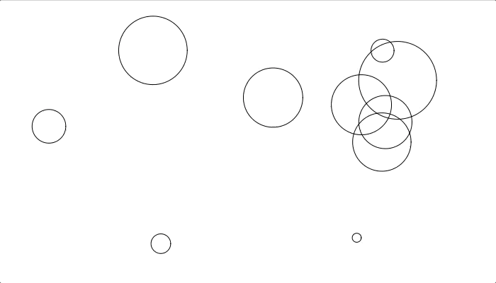
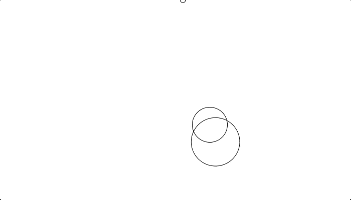
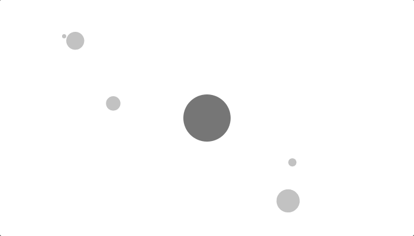
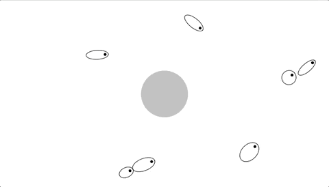

# Animation with Go
Inspired by <a href="https://twitter.com/shiffman">Daniel Shiffman</a> and his book <a href="https://natureofcode.com/">Nature of code</a>
### Bouncing balls 
Created bunch of random balls by vectorizing location and velocity 

### Balls acceleration towards mouse 

### Mutual attraction of balls 
Each ball attracts others and is attracted by others. Attraction force is calculated based on the mass of balls and the distance between them . God bless Newton and his <a href="https://en.wikipedia.org/wiki/Newton%27s_law_of_universal_gravitation">Law of universal gravitation</a>

### Oscillating around attractor
Oscillatings swings around attractor. Oscilating faster when getting closer.
